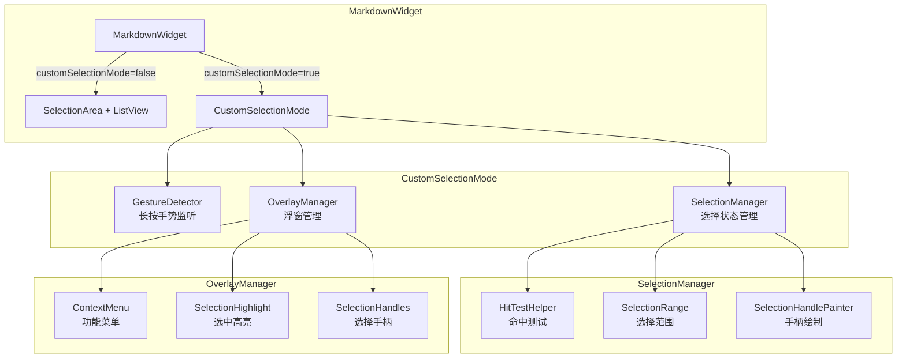
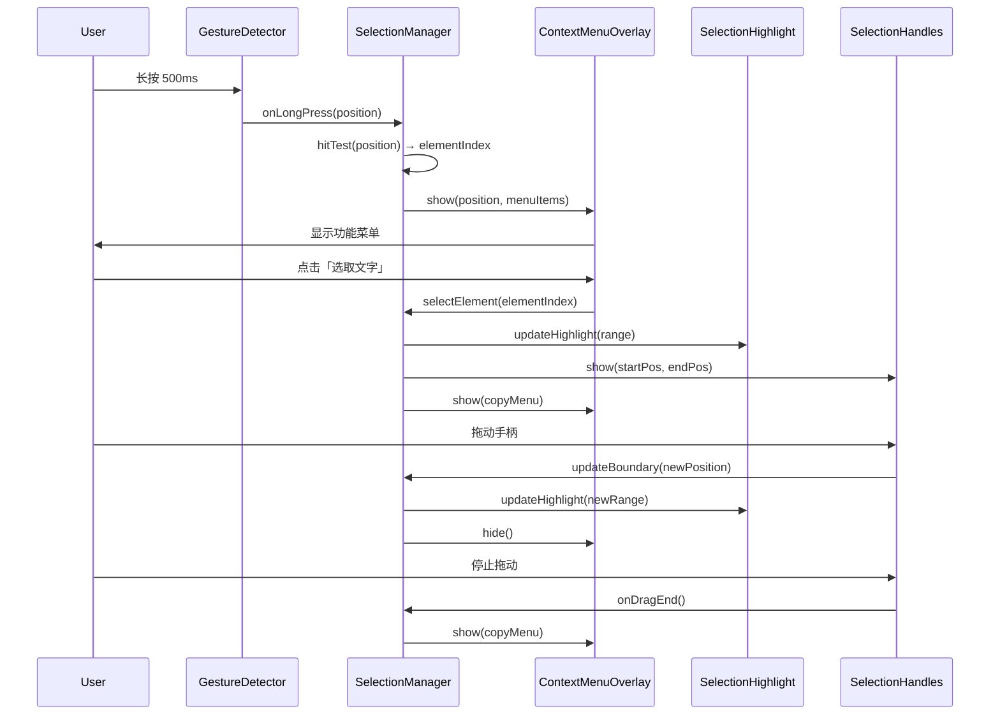
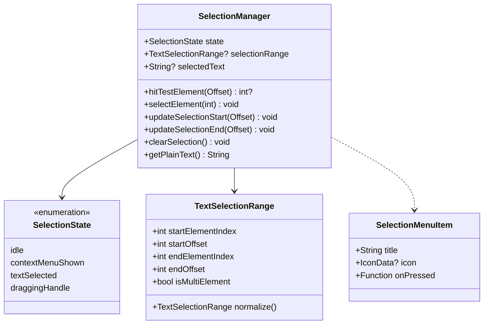
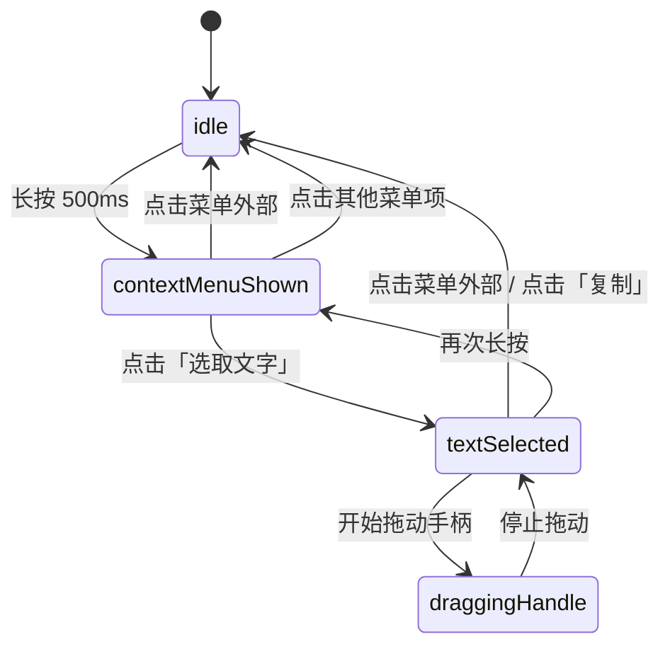

# 技术设计文档：自定义选择模式（Custom Selection Mode）

## 概述

本设计为 `markdown_widget` 包引入自定义选择模式功能。该功能允许开发者在 `MarkdownWidget` 中启用一种新的文本选择交互方式：长按时先弹出自定义功能菜单（Context Menu），用户点击「选取文字」后以 Markdown 元素为粒度进行初始选中，随后可通过拖动选择手柄（Selection Handle）精确调整选择范围，支持跨元素连续选择。

### 设计目标

1. **向后兼容**：`customSelectionMode` 默认为 `false`，不影响现有 `SelectionArea` 行为
2. **灵活定制**：通过 `contextMenuBuilder` 和 `contextMenuItems` 参数支持菜单样式和内容的完全自定义
3. **元素级选中**：以 Markdown 结构化元素（标题、段落、列表项、引用块、代码块）为粒度进行初始选中
4. **精确调整**：支持通过拖动选择手柄调整选中范围，包括跨元素连续选择
5. **最小侵入**：不修改现有 SpanNode/ElementNode 体系的核心逻辑

## 架构

### 整体架构图



### 模块职责

| 模块 | 职责 |
|------|------|
| `MarkdownWidget` | 根据 `customSelectionMode` 参数决定使用 `SelectionArea` 还是自定义选择模式 |
| `CustomSelectionOverlay` | 自定义选择模式的顶层容器，管理手势监听和子组件协调 |
| `SelectionManager` | 管理选择状态（选中范围、当前元素索引），提供选择操作 API |
| `ContextMenuOverlay` | 管理 Context Menu 的 Overlay 显示、定位和关闭 |
| `SelectionHighlightPainter` | 绘制选中文本的高亮背景 |
| `SelectionHandleWidget` | 渲染和管理可拖动的选择手柄 |
| `HitTestHelper` | 将触摸坐标映射到具体的 Markdown 元素和字符位置 |

### 数据流



## 组件与接口

### 1. MarkdownWidget 参数扩展

```dart
class MarkdownWidget extends StatefulWidget {
  // ... 现有参数 ...

  /// 是否开启自定义选择模式。
  /// 为 true 时不使用 SelectionArea，启用自定义长按菜单和元素级选中。
  /// 默认为 false。
  final bool customSelectionMode;

  /// 自定义 Context Menu 构建器。
  /// 接收长按位置和菜单项列表，返回自定义菜单 Widget。
  /// 若提供此参数，将完全替代默认 Context Menu 的渲染。
  final ContextMenuWidgetBuilder? contextMenuBuilder;

  /// 追加到默认菜单项列表末尾的自定义菜单项。
  final List<SelectionMenuItem>? contextMenuItems;

  const MarkdownWidget({
    // ... 现有参数 ...
    this.customSelectionMode = false,
    this.contextMenuBuilder,
    this.contextMenuItems,
  });
}
```

### 2. SelectionMenuItem 数据模型

```dart
/// 自定义选择模式中的菜单项
class SelectionMenuItem {
  /// 菜单项显示文本
  final String title;

  /// 菜单项图标（可选）
  final IconData? icon;

  /// 点击回调。参数为当前选中的文本内容（若有）和关闭菜单的回调。
  final void Function(String? selectedText, VoidCallback closeMenu) onPressed;

  const SelectionMenuItem({
    required this.title,
    this.icon,
    required this.onPressed,
  });
}
```

### 3. ContextMenuWidgetBuilder 类型定义

```dart
/// Context Menu 自定义构建器类型。
/// [position] 为长按位置或选中区域中心位置。
/// [menuItems] 为完整的菜单项列表（默认项 + 自定义项）。
/// [selectedText] 为当前选中的文本（选中状态下才有值）。
/// [closeMenu] 为关闭菜单的回调。
typedef ContextMenuWidgetBuilder = Widget Function(
  Offset position,
  List<SelectionMenuItem> menuItems,
  String? selectedText,
  VoidCallback closeMenu,
);
```

### 4. SelectionManager

```dart
/// 选择状态管理器
class SelectionManager extends ChangeNotifier {
  /// 当前选择状态
  SelectionState get state;

  /// 当前选中的文本范围
  TextSelectionRange? get selectionRange;

  /// 当前选中的纯文本内容
  String? get selectedText;

  /// 执行命中测试，返回长按位置对应的元素索引
  int? hitTestElement(Offset globalPosition);

  /// 选中指定索引的整个 Markdown 元素
  void selectElement(int elementIndex);

  /// 更新选择范围的起始边界
  void updateSelectionStart(Offset globalPosition);

  /// 更新选择范围的结束边界
  void updateSelectionEnd(Offset globalPosition);

  /// 清除选择状态
  void clearSelection();

  /// 获取选中文本的纯文本内容（不含 Markdown 标记）
  String getPlainText();
}
```

### 5. SelectionState 枚举

```dart
/// 自定义选择模式的状态
enum SelectionState {
  /// 无选择，无菜单
  idle,
  /// 功能菜单已显示（长按后）
  contextMenuShown,
  /// 文本已选中，复制菜单显示
  textSelected,
  /// 正在拖动选择手柄
  draggingHandle,
}
```

### 6. TextSelectionRange 数据模型

```dart
/// 表示跨元素的文本选择范围
class TextSelectionRange {
  /// 起始元素在 widget 列表中的索引
  final int startElementIndex;

  /// 起始元素内的字符偏移
  final int startOffset;

  /// 结束元素在 widget 列表中的索引
  final int endElementIndex;

  /// 结束元素内的字符偏移
  final int endOffset;

  const TextSelectionRange({
    required this.startElementIndex,
    required this.startOffset,
    required this.endElementIndex,
    required this.endOffset,
  });

  /// 是否跨越多个元素
  bool get isMultiElement => startElementIndex != endElementIndex;

  /// 确保 start 在 end 之前（规范化）
  TextSelectionRange normalize();
}
```

### 7. CustomSelectionOverlay Widget

```dart
/// 自定义选择模式的顶层容器 Widget
class CustomSelectionOverlay extends StatefulWidget {
  /// 子 Widget（即 ListView）
  final Widget child;

  /// 所有渲染的 Markdown Widget 列表（用于命中测试）
  final List<Widget> widgets;

  /// Context Menu 构建器
  final ContextMenuWidgetBuilder? contextMenuBuilder;

  /// 自定义菜单项
  final List<SelectionMenuItem>? contextMenuItems;

  const CustomSelectionOverlay({
    required this.child,
    required this.widgets,
    this.contextMenuBuilder,
    this.contextMenuItems,
  });
}
```

### 8. HitTestHelper

```dart
/// 命中测试辅助类，将全局坐标映射到 Markdown 元素和字符位置
class HitTestHelper {
  /// 根据全局坐标找到对应的 Widget 索引
  static int? findElementIndex(
    Offset globalPosition,
    List<GlobalKey> elementKeys,
  );

  /// 根据全局坐标找到 RenderParagraph 中的字符偏移
  static int? findTextOffset(
    Offset globalPosition,
    GlobalKey elementKey,
  );

  /// 判断指定索引的元素是否为可选中的文本元素
  static bool isSelectableElement(int elementIndex, List<SpanNode> nodes);

  /// 获取指定元素的全部纯文本内容
  static String getElementPlainText(int elementIndex, List<SpanNode> nodes);
}
```

### 9. ContextMenuOverlay

```dart
/// Context Menu 浮窗管理
class ContextMenuOverlay {
  /// 显示功能菜单
  void show({
    required BuildContext context,
    required Offset anchorPosition,
    required List<SelectionMenuItem> items,
    String? selectedText,
    ContextMenuWidgetBuilder? customBuilder,
  });

  /// 关闭功能菜单
  void hide();

  /// 菜单是否正在显示
  bool get isShowing;
}
```

### 10. DefaultContextMenu Widget

```dart
/// 默认的 Context Menu 样式
class DefaultContextMenu extends StatelessWidget {
  final List<SelectionMenuItem> items;
  final String? selectedText;
  final VoidCallback onClose;

  /// 默认样式：圆角矩形背景、水平排列菜单项
  @override
  Widget build(BuildContext context);
}
```

## 数据模型

### 核心数据结构



### 元素索引映射

在 `MarkdownGenerator.buildWidgets()` 生成 Widget 列表时，每个 Widget 对应一个 Markdown 块级元素。自定义选择模式需要维护以下映射关系：

| 数据 | 来源 | 用途 |
|------|------|------|
| `List<Widget> widgets` | `MarkdownGenerator.buildWidgets()` | 渲染和命中测试 |
| `List<SpanNode> spanNodes` | `WidgetVisitor.visit()` | 获取元素纯文本、判断元素类型 |
| `List<GlobalKey> elementKeys` | 为每个 Widget 分配 GlobalKey | 命中测试定位 |

### 状态转换



### MarkdownWidget 构建逻辑变更

```dart
// _MarkdownWidgetState.buildMarkdownWidget() 伪代码
Widget buildMarkdownWidget() {
  final listView = ListView.builder(...);

  if (widget.customSelectionMode) {
    // 自定义选择模式：不使用 SelectionArea，使用 CustomSelectionOverlay
    return CustomSelectionOverlay(
      child: listView,
      widgets: _widgets,
      contextMenuBuilder: widget.contextMenuBuilder,
      contextMenuItems: widget.contextMenuItems,
    );
  } else if (widget.selectable) {
    // 原有行为：使用 SelectionArea
    return SelectionArea(child: listView);
  } else {
    // 禁用选择
    return listView;
  }
}
```

### 命中测试实现策略

1. **元素级命中测试**：通过为每个 Markdown Widget 分配 `GlobalKey`，使用 `RenderBox.globalToLocal()` 和 `RenderBox.size` 判断触摸点落在哪个元素内。

2. **字符级命中测试**：找到目标元素后，获取其 `RenderParagraph`（通过遍历 RenderObject 树），调用 `RenderParagraph.getPositionForOffset()` 获取精确的字符偏移。

3. **跨元素选择**：当拖动手柄超出当前元素边界时，检测相邻元素的 `RenderBox` 范围，切换到相邻元素并计算新的字符偏移。

### 选中高亮实现策略

使用 `CustomPaint` + `TextPainter` 方案：
- 通过 `RenderParagraph.getBoxesForSelection()` 获取选中文本的矩形区域列表
- 使用 `CustomPainter` 在文本下方绘制半透明高亮背景
- 跨元素时，对每个涉及的元素分别绘制高亮

### 选择手柄实现策略

- 使用 `Overlay` + `Positioned` 定位手柄 Widget
- 手柄位置通过 `RenderParagraph.getOffsetForCaret()` 计算
- 使用 `GestureDetector` 监听手柄的拖动手势
- 拖动过程中通过 `HitTestHelper` 实时计算新的字符位置

## 正确性属性

*属性（Property）是在系统所有有效执行中都应保持为真的特征或行为——本质上是关于系统应该做什么的形式化陈述。属性是人类可读规格说明与机器可验证正确性保证之间的桥梁。*

### Property 1: customSelectionMode 禁用 SelectionArea

*对于任意* `selectable` 参数值（true 或 false），当 `customSelectionMode` 设置为 `true` 时，MarkdownWidget 的 Widget 树中不应包含 `SelectionArea` 组件，且应包含自定义选择模式的手势监听组件。

**Validates: Requirements 2.2**

### Property 2: 自定义菜单项追加到默认项之后

*对于任意*非空的 `contextMenuItems` 列表，生成的完整菜单项列表应满足：前缀为默认菜单项（至少包含「选取文字」），后缀为 `contextMenuItems` 中的所有项，且顺序与传入顺序一致。

**Validates: Requirements 3.6**

### Property 3: 菜单项点击触发回调并关闭菜单

*对于任意*菜单项，当用户点击该菜单项时，该菜单项的 `onPressed` 回调应被调用恰好一次，且 Context Menu 应在回调执行后关闭（从 Overlay 中移除）。

**Validates: Requirements 3.8**

### Property 4: 文本元素的完整选中

*对于任意*包含文本的 Markdown 块级元素（标题、段落、列表项、引用块、代码块），当用户在该元素上触发「选取文字」操作时，选中范围应覆盖该元素渲染的全部纯文本内容（不含 Markdown 语法标记），且选中文本的长度等于该元素纯文本内容的长度。

**Validates: Requirements 4.2, 4.3, 4.4, 4.5, 4.6, 4.8**

### Property 5: 非文本元素不可选中

*对于任意*非文本块级元素（表格、图片、水平分割线），当用户在该元素上触发「选取文字」操作时，选择状态应保持不变（仍为 `idle` 或 `contextMenuShown`），不应产生任何选中高亮或选择手柄。

**Validates: Requirements 4.7**

### Property 6: 复制操作写入纯文本

*对于任意*被选中的文本内容，当用户执行「复制」操作时，系统剪贴板中的内容应等于选中范围内的纯文本（不含 Markdown 标记符号如 `#`、`*`、`>`、`` ` `` 等）。

**Validates: Requirements 5.2**

### Property 7: 拖动手柄更新选择边界

*对于任意*有效的字符位置，当用户将起始（或结束）选择手柄拖动到该位置时，选择范围的起始（或结束）边界应更新为该字符位置，且高亮区域应同步反映新的选择范围。

**Validates: Requirements 6.2, 6.3**

### Property 8: 跨元素连续选择

*对于任意*两个相邻的文本 Markdown 元素，当用户将选择手柄从一个元素拖动到另一个元素时，选择范围应连续扩展至目标元素中手指所在的字符位置，形成跨元素的连续选择。

**Validates: Requirements 6.6**

### Property 9: 手柄角色交换

*对于任意*选择状态，如果用户将起始手柄拖动到结束手柄之后（或将结束手柄拖动到起始手柄之前），两个手柄的角色应自动交换，使得起始手柄始终位于选中区域前端、结束手柄始终位于末端，且选中区域至少包含 1 个字符。

**Validates: Requirements 6.7**

## 错误处理

| 场景 | 处理策略 |
|------|----------|
| 长按位置未命中任何 Markdown 元素 | 不弹出 Context Menu，保持 idle 状态 |
| 长按位置命中非文本元素后点击「选取文字」 | 不执行选中操作，关闭 Context Menu，保持 idle 状态 |
| 剪贴板写入失败 | 保留选中状态和 Context Menu 显示，不做状态变更（需求 5.5） |
| 拖动手柄超出 MarkdownWidget 可视区域 | 将选择边界限制在最近的有效字符位置 |
| 拖动手柄到达 Widget 列表首/末元素边界 | 将选择边界限制在首/末元素的首/末字符 |
| Overlay 上下文失效（Widget 被 dispose） | 安全关闭所有 Overlay entry，清除选择状态 |
| 元素 GlobalKey 对应的 RenderObject 为 null | 跳过该元素的命中测试，不触发选择 |
| 选中区域为空（起始 == 结束） | 确保至少选中 1 个字符（需求 6.7） |

### 异常恢复策略

```dart
/// 剪贴板写入的错误处理
Future<void> copyToClipboard(String text) async {
  try {
    await Clipboard.setData(ClipboardData(text: text));
    // 成功：关闭菜单，清除选中
    clearSelection();
  } catch (e) {
    // 失败：保持当前状态不变
    // 不关闭菜单，不清除选中
    debugPrint('Clipboard write failed: $e');
  }
}
```

## 测试策略

### 测试框架选择

- **单元测试 & Widget 测试**：使用 `flutter_test`（项目已有依赖）
- **属性测试（Property-Based Testing）**：使用 `glados` 包（Dart 生态中成熟的 PBT 库）
- **Mock**：使用 `mockito`（项目已有依赖）

### 属性测试配置

- 每个属性测试运行最少 100 次迭代
- 每个属性测试通过注释标注对应的设计属性
- 标注格式：`// Feature: custom-selection-mode, Property {number}: {property_text}`

### 测试分层

#### 1. 属性测试（Property-Based Tests）

| 属性 | 测试内容 | 生成器 |
|------|----------|--------|
| Property 1 | customSelectionMode=true 时无 SelectionArea | 生成随机 selectable 值 |
| Property 2 | 自定义菜单项追加顺序 | 生成随机长度的 SelectionMenuItem 列表 |
| Property 3 | 菜单项点击行为 | 生成随机菜单项列表，随机选择一项点击 |
| Property 4 | 文本元素完整选中 | 生成随机 Markdown 文本（含各类文本元素） |
| Property 5 | 非文本元素不可选中 | 生成包含表格/图片/hr 的 Markdown |
| Property 6 | 复制纯文本 | 生成含 Markdown 标记的随机文本 |
| Property 7 | 手柄拖动更新边界 | 生成随机字符位置 |
| Property 8 | 跨元素选择 | 生成多元素 Markdown，随机跨元素拖动 |
| Property 9 | 手柄角色交换 | 生成随机选择状态，模拟交叉拖动 |

#### 2. 单元测试（Example-Based Tests）

- 默认参数值验证（customSelectionMode 默认 false）
- SelectionArea 在不同参数组合下的存在性
- 长按 500ms 触发 Context Menu
- 长按不触发文本选中
- 默认菜单包含「选取文字」
- contextMenuBuilder 优先级高于默认渲染
- 点击菜单外部关闭菜单
- 选中后显示复制菜单
- 复制后清除选中状态
- 拖动过程中菜单隐藏
- 停止拖动后菜单重新显示

#### 3. 边界测试（Edge Cases）

- 剪贴板写入失败时状态保持
- 空 Markdown 内容的长按处理
- 单字符元素的选中和手柄拖动
- Widget dispose 后的 Overlay 清理
- 快速连续长按的防抖处理

#### 4. 集成测试

- 完整的长按 → 菜单 → 选取 → 拖动 → 复制流程
- 与 TocController 的兼容性
- 与 ListView 滚动的兼容性
- 不同 Markdown 内容组合的渲染正确性

### 文件组织

```
lib/
  widget/
    selection/
      custom_selection_overlay.dart    # CustomSelectionOverlay Widget
      selection_manager.dart           # SelectionManager 状态管理
      context_menu_overlay.dart        # ContextMenuOverlay 浮窗管理
      default_context_menu.dart        # DefaultContextMenu 默认样式
      selection_highlight_painter.dart # 选中高亮绘制
      selection_handle_widget.dart     # 选择手柄 Widget
      hit_test_helper.dart             # 命中测试辅助
      selection_models.dart            # 数据模型（SelectionMenuItem, TextSelectionRange, SelectionState）
    markdown.dart                      # 修改：添加新参数，调整构建逻辑
  config/
    configs.dart                       # 修改：添加 SelectionConfig（可选）

test/
  selection/
    selection_manager_test.dart        # SelectionManager 单元测试
    hit_test_helper_test.dart          # HitTestHelper 单元测试
    context_menu_test.dart             # Context Menu Widget 测试
    selection_handle_test.dart         # 选择手柄 Widget 测试
    custom_selection_property_test.dart # 属性测试
    custom_selection_integration_test.dart # 集成测试

example/
  lib/
    custom_selection_example.dart      # 自定义选择模式示例
```
