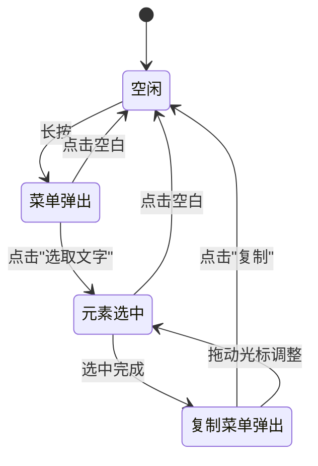

# 自定义选择模式需求文档 — 评审报告

> 评审人：Opus (AI)  
> 评审日期：2026-05-27  
> 针对文档：`docs/自定义选择模式需求文档.md`

---

## 一、总体评价

需求文档清晰地描述了业务痛点和期望目标，交互流程的核心路径（长按 → 弹出菜单 → 选取文字 → 选中元素 → 复制）易于理解。但在**接口设计细节、边界条件、交互细节、非功能性需求**等方面存在较多待澄清和补充的内容。以下将从多个维度逐条分析。

---

## 二、优点

1. **需求背景交代充分**：明确说明了当前实现基于 `SelectionArea`，以及其局限性（菜单样式不可定制、选择范围不够灵活）。
2. **向后兼容意识明确**：第1条需求明确要求未开启自定义模式时保持现有行为不变，体现了对存量用户的保护。
3. **核心交互流程描述清晰**：长按 → 弹出自定义菜单 → 点击"选取文字" → 按元素选中 → 弹出"复制"菜单 的流程路径直观。

---

## 三、问题与建议

### 3.1 API 设计层面

#### P0 — 缺少开启方式的定义

> 文档多次提到"开启自定义选择模式"，但**未定义如何开启**。

- 是通过新增一个 `bool customSelectable` 参数？
- 还是通过传入一个配置对象（例如 `CustomSelectionConfig`）来隐式开启？
- 与现有 `selectable` 参数的关系是什么？互斥？还是 `customSelectable` 为 `selectable` 的子模式？

**建议**：明确新增参数的名称、类型与默认值，并说明与 `selectable` 的交互逻辑。推荐方案：

```dart
MarkdownWidget(
  selectable: true, // 保留原参数
  selectionConfig: CustomSelectionConfig(
    enabled: true,
    menuBuilder: (context, position) => YourMenu(),
    // ...
  ),
)
```

#### P0 — 自定义菜单的接口未定义

> 文档提到"样式支持自定义"和"支持自定义其他功能菜单扩展"，但完全没有说明自定义的方式。

需要明确：
1. 菜单的构建方式：是通过 `Widget Function(BuildContext, Offset)` 回调？还是传入菜单项列表？
2. 菜单项的数据模型：每个菜单项需要什么信息？（图标、文字、点击回调）
3. 默认菜单项"选取文字"是否可被移除/重排？
4. 第二阶段弹出的"复制"菜单是否也支持自定义扩展？（如增加"分享"、"翻译"等功能）

**建议**：定义类似如下的接口约定：

```dart
typedef SelectionMenuBuilder = Widget Function(
  BuildContext context,
  Offset position,
  MarkdownElement element, // 当前触发的 markdown 元素信息
  VoidCallback selectText,  // 触发"选取文字"的回调
);

typedef CopyMenuBuilder = Widget Function(
  BuildContext context,
  Offset position,
  String selectedText,
  VoidCallback copyText,
);
```

---

### 3.2 交互细节层面

#### P0 — 菜单浮窗的定位与边界处理

- 文档说"在用户手按住的位置上方弹出"，但未说明：
  - 若长按位置靠近屏幕顶部，菜单应显示在下方还是仍然在上方溢出？
  - 若长按位置靠近屏幕左右边缘，菜单如何调整位置？
  - 菜单使用 `Overlay`/`OverlayEntry` 还是使用 `PopupMenuButton` 之类的现有方案？

**建议**：补充菜单定位策略的边界处理规则，可参考 Flutter 原生 `TextSelectionToolbar` 的自适应定位逻辑。

#### P1 — 菜单浮窗的关闭时机

文档未说明菜单应在何时关闭，以下场景需要明确：
1. 用户点击菜单以外的区域 → 是否关闭菜单？是否取消选中？
2. 用户滚动内容 → 是否关闭菜单？
3. 用户点击另一处并长按 → 是否关闭上一个菜单并弹出新菜单？
4. 选中文字后，用户拖动光标调整范围时，"复制"菜单是否保持显示？位置是否跟随？

**建议**：补充菜单生命周期的完整状态机描述。

#### P1 — 手势冲突处理

- 长按手势可能与 `MarkdownWidget` 内部的链接点击（`LinkNode`）、图片点击、复选框交互产生冲突。
- `MarkdownWidget` 位于 `ListView` 中，长按手势与滚动手势的竞争如何处理？

**建议**：说明手势优先级规则。例如：链接区域长按不触发选择菜单，触发链接预览（或仍触发菜单但菜单中不包含"选取文字"）。

#### P2 — 触觉/视觉反馈

- 长按触发时是否有震动反馈（`HapticFeedback`）？
- 文字被选中时的高亮颜色是否可配置？
- 长按到菜单弹出是否有延迟阈值？默认值是多少？

---

### 3.3 Markdown 元素选中规则

#### P0 — 元素选中粒度定义不完整

文档第3条列举了部分元素的选中规则，但存在以下问题：

| Markdown 元素 | 文档是否定义 | 建议补充 |
|---|---|---|
| 标题 (h1-h6) | ✅ 选中整个标题 | — |
| 正文段落 (p) | ✅ 选中"全部正文" | ⚠️ "全部正文"的范围歧义，见下 |
| 列表项 (li) | ✅ 选中当前列表项 | 嵌套列表时是否包含子项？ |
| 引用 (blockquote) | ✅ 选中区块全部文字 | 嵌套引用只选中当前层级还是全部？ |
| 代码块 (pre/code) | ✅ 选中区块全部文字 | — |
| 表格 (table) | ❌ | 选中整个表格？还是当前单元格？ |
| 图片 (img) | ❌ | 图片是否参与选择？选中后复制什么？alt text？ |
| 链接 (a) | ❌ | 选中链接文字？还是包含 URL？ |
| 水平线 (hr) | ❌ | 不可选？还是跳过？ |
| 行内代码 (code) | ❌ | 选所在段落？还是只选行内代码自身？ |
| 复选框 (input) | ❌ | 是否可选？选中后的内容格式？ |

#### P0 — "正文部分"定义歧义

> "如果选中的区域是markdown的元素是正文部分，则将选中全部正文部分"

- "正文部分"是指当前**段落(p)**？还是所有非标题、非列表的**连续文本块**？
- 若存在多个连续段落，是选中当前段落还是选中所有连续段落？

**建议**：改为明确表述，例如"选中当前段落(`<p>`)元素的全部文字"。

#### P1 — 嵌套元素的选中规则

当元素发生嵌套时（例如引用中包含列表，列表项中包含代码块），选中粒度如何确定？
- 应以**最内层（最精确）**元素为选中单位？
- 还是以**最外层容器**为选中单位？

**建议**：明确嵌套场景下的优先级规则，推荐以**最内层可识别元素**为单位。

---

### 3.4 技术实现层面

#### P1 — 与 `SelectionArea` 的关系

当前实现基于 `SelectionArea`，自定义选择模式是：
1. **完全替换** `SelectionArea`，自行实现选中/复制逻辑？
2. 还是 **在 `SelectionArea` 基础上扩展**，仅自定义菜单部分（通过 `contextMenuBuilder` 等）？

> [!IMPORTANT]
> Flutter 3.27.4 的 `SelectionArea` 已支持 `contextMenuBuilder` 回调，可以自定义右键/长按菜单。是否考虑优先利用这一能力，而非完全自行实现？这将大幅降低实现复杂度。

#### P1 — 元素识别的技术方案

需求要求"点击处的 markdown 元素"能被识别，但当前架构中：
- `MarkdownGenerator.buildWidgets()` 返回的是 `List<Widget>`，每个 Widget 对应一个顶层 markdown 节点。
- Widget 通过 `SpanNode.build()` 生成 `TextSpan`/`InlineSpan`，渲染为 `Text.rich()`。
- 需要一种机制将**触摸位置**映射回**对应的 SpanNode 或 markdown AST 节点**。

当前代码中没有存储从 Widget → 原始 markdown 节点的映射关系。这是实现的关键挑战。

**建议**：在需求中说明是否接受对 `MarkdownGenerator` 和 `WidgetVisitor` 进行较大改造，以支持元素定位能力。

#### P2 — `MarkdownBlock` 的支持

当前工程中有两个入口 Widget：
- `MarkdownWidget`（基于 `ListView`，可滚动）
- `MarkdownBlock`（基于 `Column`，不可滚动）

需求文档仅提到 `MarkdownWidget`，是否同样需要支持 `MarkdownBlock`？

---

### 3.5 非功能性需求

#### P1 — 多平台适配

文档未提及平台差异：
- **移动端 (Android/iOS)**：长按交互自然。
- **桌面端 (Windows/macOS/Linux)**：右键点击是否也应触发自定义菜单？
- **Web 平台**：浏览器自身的选择和右键菜单行为可能冲突。

**建议**：明确首要支持平台，以及各平台的交互差异策略。

#### P2 — 性能影响评估

自定义选择模式引入 `GestureDetector`（长按检测）和 `Overlay`（菜单浮窗），对长列表（大量 markdown 内容）的性能影响需评估。

#### P2 — 无障碍访问 (Accessibility)

选择模式和自定义菜单是否需要支持 `Semantics` 以兼容屏幕阅读器？

---

### 3.6 文档完善建议

#### P1 — 缺少流程图/状态图

建议补充交互状态流转图，例如：



#### P2 — 缺少验收标准 (Acceptance Criteria)

建议补充明确的验收标准列表，例如：
1. 未开启自定义模式时，行为与现有版本完全一致
2. 开启自定义模式后，长按弹出自定义菜单
3. 点击"选取文字"后，准确选中对应 markdown 元素
4. 用户可拖动光标调整选中范围
5. 点击"复制"后，选中内容正确复制到剪贴板
6. `example` 目录下有完整的演示代码

#### P2 — 缺少版本与排期信息

文档指定了 Flutter 版本 `3.27.4`，但未说明：
- `markdown_widget` 自身的目标版本号
- 是否需要分阶段交付（如先实现菜单自定义，再实现元素级选中）

---

## 四、评审结论汇总

| 优先级 | 数量 | 关键项 |
|---|---|---|
| **P0 (阻塞)** | 4 | 开启方式未定义、菜单接口未定义、元素选中粒度不完整、"正文"定义歧义 |
| **P1 (重要)** | 6 | 菜单关闭时机、手势冲突、嵌套选中规则、与 SelectionArea 的关系、元素识别方案、多平台 |
| **P2 (建议)** | 5 | 反馈细节、MarkdownBlock 支持、性能/无障碍、流程图、验收标准 |

> [!IMPORTANT]
> 建议在开始方案设计前，优先补充 **P0** 级别的内容，以避免后续设计返工。特别是 API 接口的定义和元素选中粒度的明确，是整个方案设计的基础。
