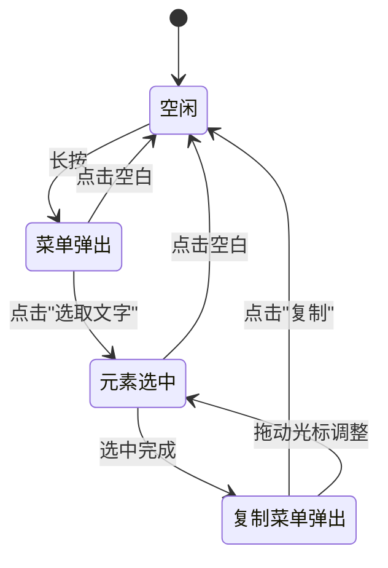

# 自定义选择模式需求评审报告

> 评审人：Qwen 3.7 Max (AI)  
> 评审日期：2026-05-27  
> 针对文档：`docs/自定义选择模式需求文档.md`

---

## 一、总体评价

该需求文档从业务痛点出发，逻辑主线清晰：**现状局限 → 期望能力 → 交互路径 → 交付目标**。核心创新点在于提出了"两段式选择交互"（先弹菜单、后按元素选中），这在 Flutter Markdown 渲染组件领域是一个具有实用价值的差异化能力。

但从"可执行工程规格"的角度衡量，文档仍处于**需求意向描述**阶段，尚未达到可直接指导编码的精度。主要差距体现在以下四个维度：

1. **API 形态与参数契约完全空白**：文档未涉及任何接口设计，导致实现阶段将面临大量临场决策。
2. **Markdown 元素选中粒度定义不完整**：仅覆盖 5 类元素，且部分表述存在歧义。
3. **交互状态机缺失**：各状态之间的流转条件和行为未形成闭环描述。
4. **技术约束与边界条件未声明**：包括平台范围、性能要求、与现有功能的兼容性等。

**整体评定：需求方向合理，业务价值明确，但需补充工程级规格后方可进入实现阶段。**

---

## 二、优点

1. **痛点定位准确**：精准指出了 `SelectionArea` 的两个核心局限——选择范围不可控、菜单样式不可定制。这两个问题确实是当前架构的瓶颈。
2. **向后兼容意识强**：第 1 条需求明确"未开启自定义模式时保持现有逻辑不变"，体现了对存量用户的保护意识。
3. **交互路径描述直观**：长按 → 弹出自定义菜单 → 点击"选取文字" → 按元素选中 → 弹出"复制"菜单 → 复制，这条主线易于理解。
4. **交付目标明确**：要求在 `example` 目录下提供使用范例，且指定了 Flutter 版本（3.27.4），降低了交付歧义。

---

## 三、问题与建议

### 3.1 API 设计层面

#### P0 — 开启方式与参数体系未定义

文档多次提到"开启自定义选择模式"，但**未定义如何开启**，也未说明新增参数的形态。这会导致实现阶段出现以下不确定性：

- 是通过 `bool` 开关？还是通过传入配置对象隐式开启？
- 与现有 `selectable` 参数的关系是什么？互斥？子模式？正交？
- `MarkdownWidget` 和 `MarkdownBlock` 是否共享同一套 API？

**建议**：明确新增参数的命名、类型与默认值，并说明与 `selectable` 的交互逻辑。推荐方案：

```dart
MarkdownWidget(
  data: markdownContent,
  selectable: true, // 保留原参数，控制是否启用选择能力
  selectionConfig: CustomSelectionConfig(
    enabled: false, // 默认关闭，保持向后兼容
    // ...其他配置
  ),
)
```

#### P0 — 自定义菜单的接口契约未定义

文档提到"样式支持自定义"和"支持自定义其他功能菜单扩展"，但未说明：

1. 菜单的构建方式：是通过 `Widget Function(BuildContext, Offset)` 回调？还是传入菜单项列表？
2. 菜单项的数据模型：每个菜单项需要什么信息？（图标、文字、点击回调）
3. 默认菜单项"选取文字"是否可被移除/重排？
4. 第二阶段弹出的"复制"菜单是否也支持自定义扩展？（如增加"分享"、"翻译"等功能）
5. 菜单 builder 能拿到哪些上下文信息？（元素类型、元素纯文本、全局坐标、关闭菜单回调等）

**建议**：定义菜单构建器的回调签名，明确入参和返回值。例如：

```dart
typedef SelectionMenuBuilder = Widget Function(
  BuildContext context,
  Offset position,
  MarkdownElementInfo elementInfo, // 当前触发的 markdown 元素信息
  VoidCallback onSelectText,       // 触发"选取文字"的回调
);

typedef CopyMenuBuilder = Widget Function(
  BuildContext context,
  Offset position,
  String selectedText,
  VoidCallback onCopy,
);
```

---

### 3.2 Markdown 元素选中粒度

#### P0 — 元素选中粒度定义不完整

文档第 3 条列举了部分元素的选中规则，但存在以下覆盖缺失和歧义：

| Markdown 元素 | 文档是否定义 | 建议补充 |
|---|---|---|
| 标题 (h1-h6) | ✅ 选中整个标题 | 是否包含标题前后的空行？ |
| 正文段落 (p) | ⚠️ 表述有歧义 | "全部正文部分"的范围需明确，见下 |
| 列表项 (li) | ✅ 选中当前列表项 | 嵌套列表时是否包含子项？ |
| 引用 (blockquote) | ✅ 选中区块全部文字 | 嵌套引用只选中当前层级还是全部？ |
| 代码块 (pre/code) | ✅ 选中区块全部文字 | 复制时是否保留缩进、换行和语言标记？ |
| 表格 (table) | ❌ 未定义 | 选中整个表格？当前行？还是当前单元格？ |
| 图片 (img) | ❌ 未定义 | 图片是否参与选择？选中后复制什么？alt text？ |
| 链接 (a) | ❌ 未定义 | 选中链接文字？还是包含 URL？ |
| 水平线 (hr) | ❌ 未定义 | 无文字，不可选？还是跳过？ |
| 行内代码 (code) | ❌ 未定义 | 选所在段落？还是只选行内代码自身？ |
| 复选框 (input) | ❌ 未定义 | 是否可选？选中后的内容格式？ |

#### P0 — "正文部分"定义歧义

> "如果选中的区域是markdown的元素是正文部分，则将选中全部正文部分"

这句话存在两种理解：
- **理解 A**：选中当前**段落 (p)** 元素的全部文字。
- **理解 B**：选中所有连续的正文文本块（可能跨越多个段落）。

**建议**：改为明确表述，例如"选中当前段落 (`<p>`) 元素的全部文字"。

#### P1 — 嵌套元素的选中规则

当元素发生嵌套时（例如引用中包含列表，列表项中包含代码块），选中粒度如何确定？
- 应以**最内层（最精确）** 元素为选中单位？
- 还是以**最外层容器**为选中单位？

**建议**：明确嵌套场景下的优先级规则。推荐以**最内层可识别块级元素**为单位，例如点击 `> - **bold**` 中的 `bold`，选中对应的列表项 (li)，而非整段引用 (blockquote)。

---

### 3.3 交互细节层面

#### P0 — 菜单浮窗的定位与边界处理

文档说"在用户手按住的位置上方弹出"，但未说明：
- 若长按位置靠近屏幕顶部，菜单应显示在下方还是仍然在上方溢出？
- 若长按位置靠近屏幕左右边缘，菜单如何调整位置？
- 菜单使用 `Overlay`/`OverlayEntry` 还是使用 `PopupMenuButton` 之类的现有方案？

**建议**：补充菜单定位策略的边界处理规则，可参考 Flutter 原生 `TextSelectionToolbar` 的自适应定位逻辑。

#### P1 — 菜单浮窗的关闭时机

文档未说明菜单应在何时关闭，以下场景需要明确：
1. 用户点击菜单以外的区域 → 是否关闭菜单？是否取消选中？
2. 用户滚动内容 → 是否关闭菜单？
3. 用户点击另一处并长按 → 是否关闭上一个菜单并弹出新菜单？
4. 选中文字后，用户拖动光标调整范围时，"复制"菜单是否保持显示？位置是否跟随？

**建议**：补充菜单生命周期的完整状态机描述。

#### P1 — 手势冲突处理

长按手势可能与 `MarkdownWidget` 内部的交互元素产生冲突：
- **链接 (LinkNode)**：当前使用 `TapGestureRecognizer`，长按手势与链接点击如何区分？
- **图片 (ImageNode)**：图片可能支持长按预览/保存，与自定义选择菜单如何共存？
- **复选框 (InputNode)**：复选框是可交互元素（勾选/取消），长按应触发勾选还是选择菜单？
- **代码块复制按钮**：代码块已有独立的 copy 按钮（示例 app 中的 `CodeWrapperWidget`），与自定义选择模式如何共存？
- **ListView 滚动**：长按手势与滚动手势的竞争如何处理？

**建议**：说明手势优先级规则。例如：链接区域长按不触发选择菜单，触发链接预览（或仍触发菜单但菜单中不包含"选取文字"）。

#### P2 — 触觉/视觉反馈

- 长按触发时是否有震动反馈（`HapticFeedback`）？
- 文字被选中时的高亮颜色是否可配置？
- 长按到菜单弹出是否有延迟阈值？默认值是多少？

---

### 3.4 技术实现层面

#### P1 — 与 `SelectionArea` 的关系

当前实现基于 `SelectionArea`（见 [markdown.dart:128-130](../lib/widget/markdown.dart#L128-L130) 和 [markdown_block.dart:38](../lib/widget/markdown_block.dart#L38)），自定义选择模式是：
1. **完全替换** `SelectionArea`，自行实现选中/复制逻辑？
2. 还是 **在 `SelectionArea` 基础上扩展**，仅自定义菜单部分（通过 `contextMenuBuilder` 等）？

> **重要提示**：Flutter 3.27.4 的 `SelectionArea` 已支持 `contextMenuBuilder` 回调，可以自定义右键/长按菜单。是否考虑优先利用这一能力，而非完全自行实现？这将大幅降低实现复杂度。

**两条技术路线对比：**

| | 方案 A：弃用 SelectionArea | 方案 B：分层状态切换 |
|---|---|---|
| 做法 | 用 `SelectableRegion` + `SelectionHandle` 手动管理选择状态 | 非自定义模式保持现状；自定义模式下先禁用 SelectionArea，弹出菜单后再按需启用 |
| 优点 | 完全控制手势和菜单，灵活性最高 | 复用现有 SelectionArea，改动范围小 |
| 缺点 | 需要重新实现大量 Flutter 已提供的选择交互，工作量大且容易遗漏细节 | 状态切换复杂，SelectionArea 的启用/禁用可能导致 widget 重建和视觉闪烁 |
| 推荐 | 长期来看是更干净的方案 | 可作为快速验证原型 |

#### P1 — 元素识别的技术方案

需求要求"点击处的 markdown 元素"能被识别，但当前架构中：
- `MarkdownGenerator.buildWidgets()` 返回的是 `List<Widget>`，每个 Widget 对应一个顶层 markdown 节点。
- Widget 通过 `SpanNode.build()` 生成 `TextSpan`/`InlineSpan`，渲染为 `Text.rich()`。
- 需要一种机制将**触摸位置**映射回**对应的 SpanNode 或 markdown AST 节点**。

当前代码中没有存储从 Widget → 原始 markdown 节点的映射关系。这是实现的关键挑战。

**建议**：在需求中说明是否接受对 `MarkdownGenerator` 和 `WidgetVisitor` 进行较大改造，以支持元素定位能力。例如引入 `MarkdownElementInfo` 模型，至少包含：`tag`、`plainText`、`sourceText`、`widgetIndex`、`globalRect`、`parentTags`。

#### P1 — 程序化选中的实现路径

`Text.rich` 不是 `EditableText`，不支持通过 `TextEditingController.selection` 设置选择范围。可行的实现方式：
- 给每个 ListView item 包一个独立的 `SelectableRegion`（或其更轻量的变体），在"选取文字"时程序化设置选择范围
- 使用 `RenderParagraph` 层的底层 API 控制选择

无论哪种方式，都需要**深入 Flutter 的 `SelectionArea` / `SelectableRegion` / `SelectionHandler` 体系**，不是简单的上层封装。

#### P2 — `MarkdownBlock` 的支持

当前工程中有两个入口 Widget：
- `MarkdownWidget`（基于 `ListView`，可滚动）
- `MarkdownBlock`（基于 `Column`，不可滚动）

需求文档仅提到 `MarkdownWidget`，是否同样需要支持 `MarkdownBlock`？

**建议**：明确支持范围。如果需要支持 `MarkdownBlock`，API 设计应统一。

---

### 3.5 非功能性需求

#### P1 — 多平台适配

文档未提及平台差异：
- **移动端 (Android/iOS)**：长按交互自然。
- **桌面端 (Windows/macOS/Linux)**：右键点击是否也应触发自定义菜单？
- **Web 平台**：浏览器自身的选择和右键菜单行为可能冲突。

**建议**：明确首要支持平台，以及各平台的交互差异策略。例如第一阶段仅保证移动端长按，桌面和 Web 保持现有 `SelectionArea` 行为。

#### P2 — 性能影响评估

自定义选择模式引入 `GestureDetector`（长按检测）和 `Overlay`（菜单浮窗），对长列表（大量 markdown 内容）的性能影响需评估。

#### P2 — 无障碍访问 (Accessibility)

选择模式和自定义菜单是否需要支持 `Semantics` 以兼容屏幕阅读器？

#### P2 — 与 TOC 功能的交互

`MarkdownWidget` 依赖 `AutoScrollTag`、`VisibilityDetector`、`ListView.builder` 实现 TOC 滚动联动。选中状态下 TOC 跳转会触发 ListView 滚动，选中状态是否应清除？

---

### 3.6 文档完善建议

#### P1 — 缺少流程图/状态图

建议补充交互状态流转图，例如：



#### P2 — 缺少验收标准 (Acceptance Criteria)

建议补充明确的验收标准列表，例如：
1. 未开启自定义模式时，行为与现有版本完全一致
2. 开启自定义模式后，长按弹出自定义菜单
3. 点击"选取文字"后，准确选中对应 markdown 元素
4. 用户可拖动光标调整选中范围
5. 点击"复制"后，选中内容正确复制到剪贴板
6. `example` 目录下有完整的演示代码

#### P2 — 缺少版本与排期信息

文档指定了 Flutter 版本 `3.27.4`，但未说明：
- `markdown_widget` 自身的目标版本号
- 是否需要分阶段交付（如先实现菜单自定义，再实现元素级选中）

#### P2 — 复制内容格式未定义

文档提到"复制内容"，但未说明复制的是：
- 渲染后的纯文本；
- Markdown 源码；
- 带列表编号或 bullet 的文本；
- 表格的 TSV/Markdown 表格文本；
- 代码块是否保留原始换行和缩进；
- 链接是只复制文字，还是复制 URL。

---

## 四、评审结论汇总

| 优先级 | 数量 | 关键项 |
|---|---|---|
| **P0 (阻塞)** | 4 | 开启方式未定义、菜单接口未定义、元素选中粒度不完整、"正文"定义歧义 |
| **P1 (重要)** | 8 | 菜单关闭时机、手势冲突、嵌套选中规则、与 SelectionArea 的关系、元素识别方案、程序化选中路径、多平台、流程图 |
| **P2 (建议)** | 7 | 反馈细节、MarkdownBlock 支持、性能/无障碍、TOC 交互、验收标准、版本排期、复制格式 |

---

## 五、建议落地路径

建议把需求拆成两个阶段。

**第一阶段做 MVP：**
- 只支持 `MarkdownWidget`（或明确同步支持 `MarkdownBlock`）。
- 只保证移动端长按。
- 默认选择单位限定为顶层块级 item 或最小可独立块级元素。
- 菜单支持 builder 自定义，但复制内容先使用纯文本。
- 先覆盖标题、段落、列表项、引用、代码块，表格和图片给出降级策略。

**第二阶段再增强：**
- 支持表格单元格/行/整表的精细规则。
- 支持桌面右键、Web 鼠标拖选等平台行为。
- 支持更丰富的复制格式，如 Markdown 源码、纯文本、带 URL 的链接文本。
- 支持跨多个 Markdown 元素拖动选择后的自定义菜单。

---

## 六、整体可行性判断

| 维度 | 评估 |
|------|------|
| 需求合理性 | 合理，解决了真实痛点 |
| 技术可行性 | 可落地，但复杂度**中高** |
| 工作量 | 预估 5-8 人天（含调试和测试） |
| 核心风险 | SelectionArea 手势拦截与程序化选择范围控制 |
| 对现有代码的侵入性 | 中等，需要重构 `MarkdownWidget.build()` 中的选择逻辑 |

---

> **重要提示**：建议在开始方案设计前，优先补充 **P0** 级别的内容，以避免后续设计返工。特别是 API 接口的定义和元素选中粒度的明确，是整个方案设计的基础。如果只做移动端 MVP，工作量可控；如果要求完整替代 Flutter 原生选择体系，并覆盖桌面/Web/嵌套表格/跨块拖选，则需要更系统的选择架构设计。
